# S.S. GearZone E-Commerce Platform 🛒


A full-stack, highly dynamic E-Commerce application built with Spring Boot. Designed with a premium "Solid Dark" aesthetic, this platform supports a complete shopping experience from browsing products to secure checkout and robust admin management.

## 📸 Screenshots

*(Add your screenshots here by saving them in a `screenshots` folder and un-commenting the lines below)*


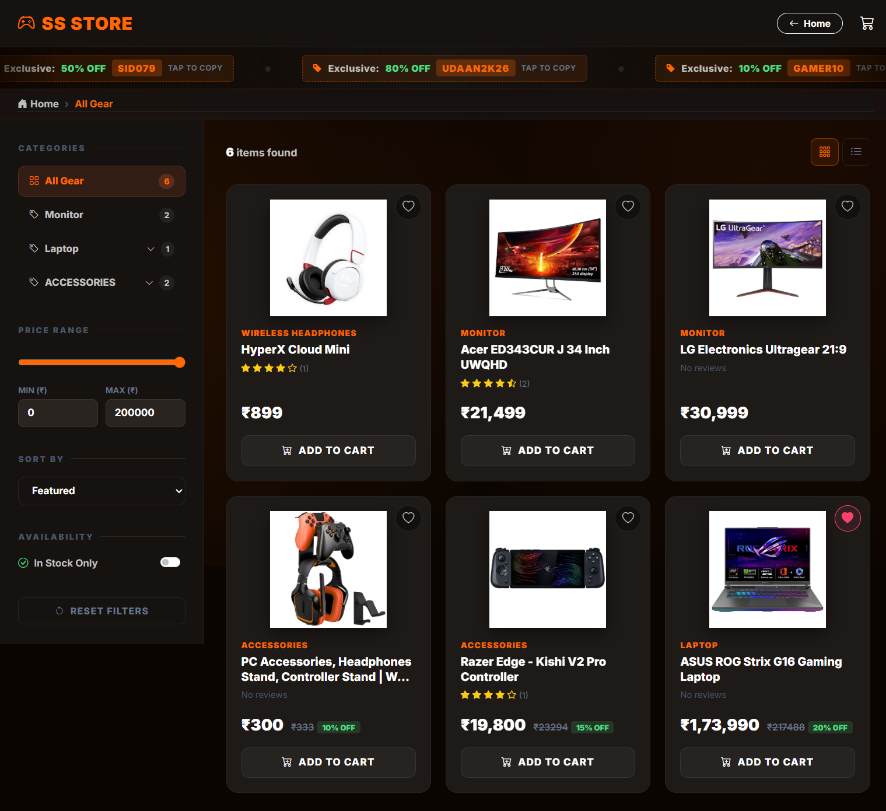
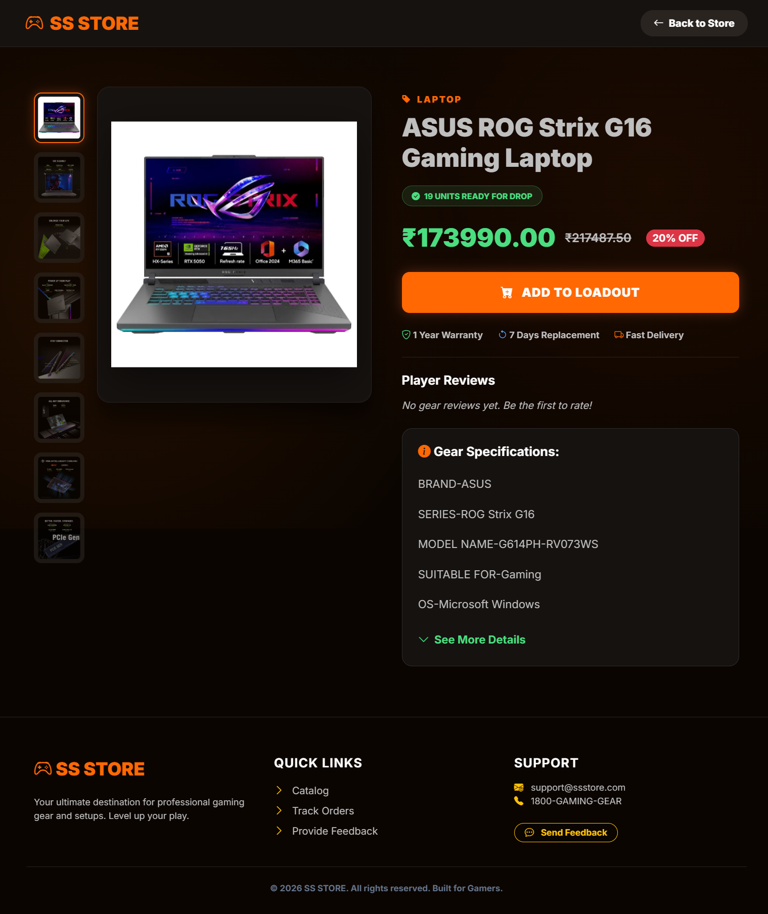
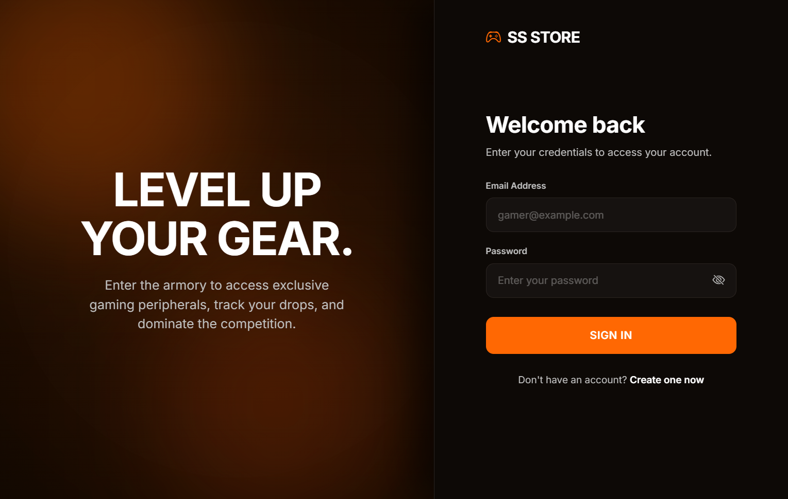

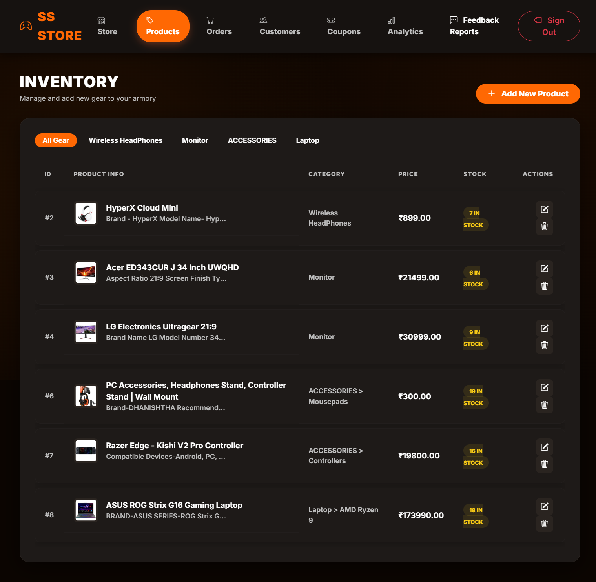
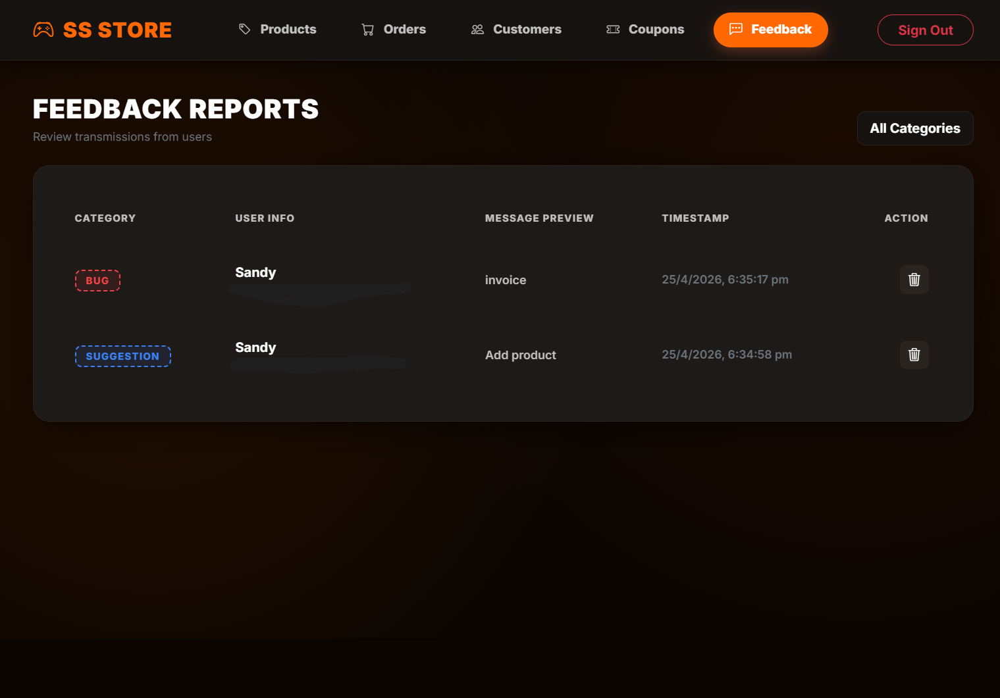
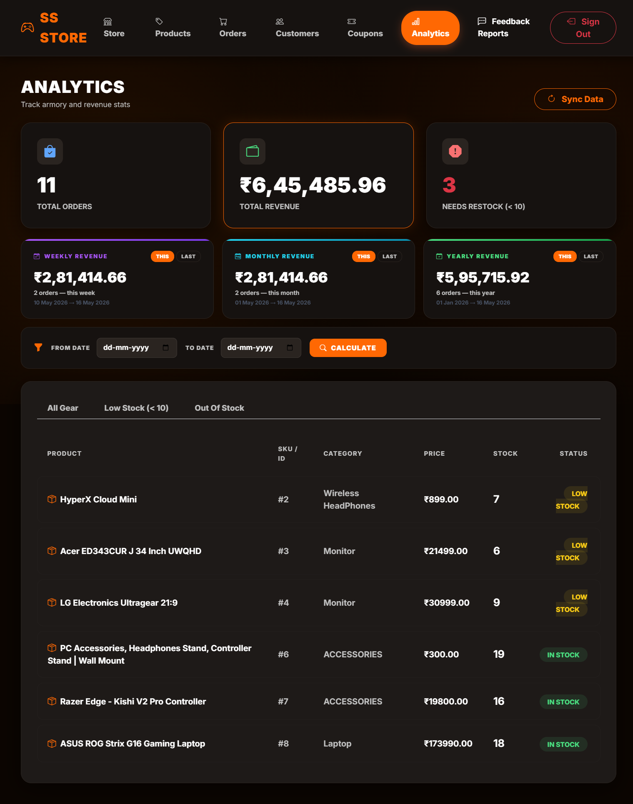
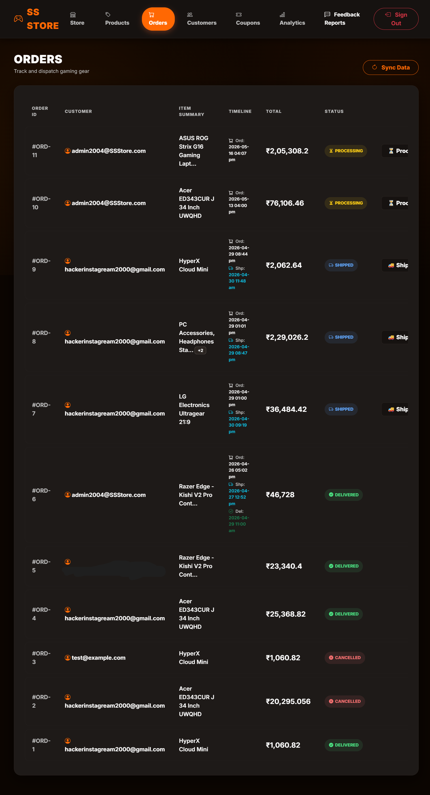
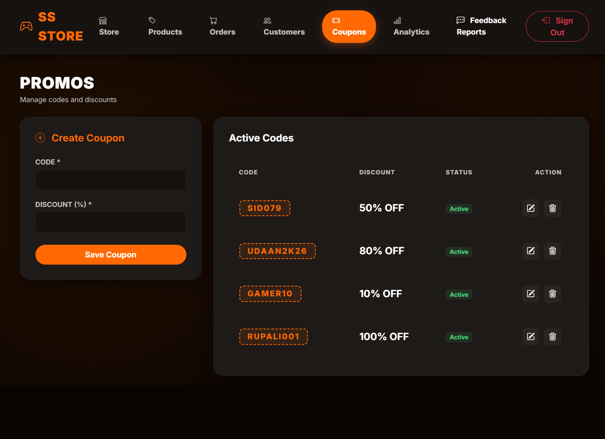
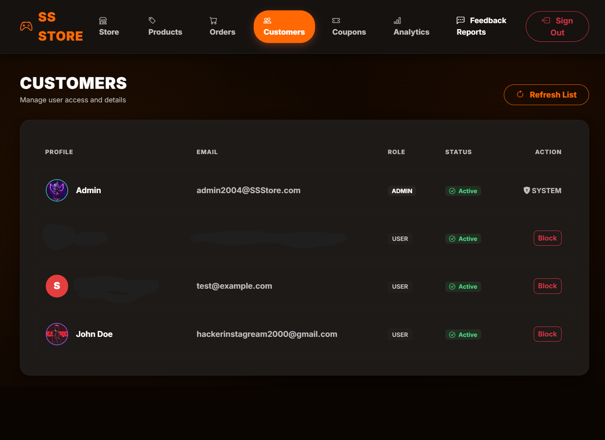
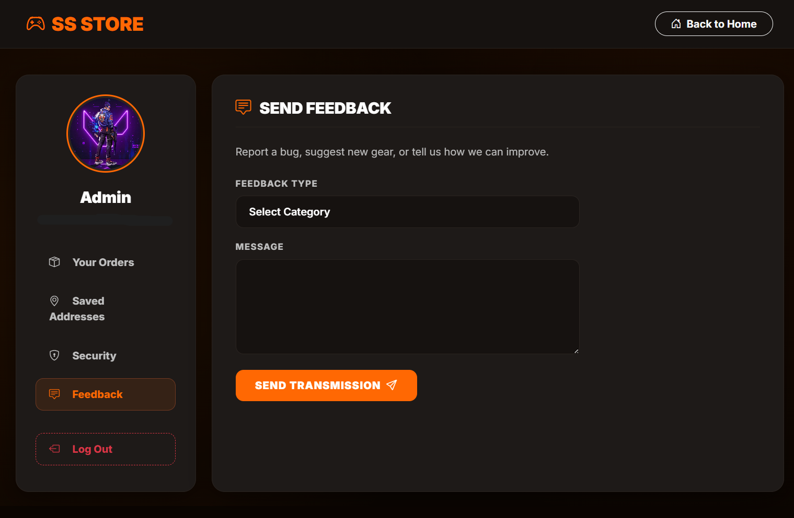
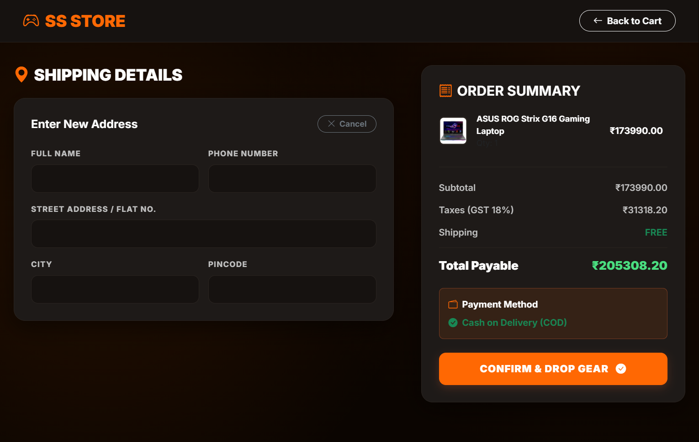
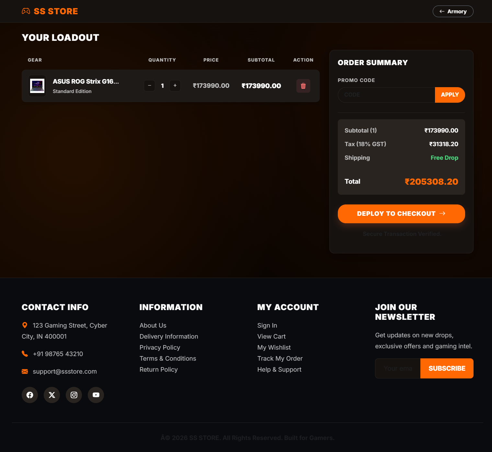

## 🚀 Key Features

*   **Real-Time Synchronization:** Uses Server-Sent Events (SSE) for dynamic updates without page reloads.
*   **Comprehensive Modules:** Fully integrated User authentication, Product cataloging, and Order processing systems.
*   **Dynamic Coupon Management:** API-driven centralized coupon system with real-time reflections across the storefront and admin panel.
*   **Admin Dashboard:** Analytical reporting, including real-time revenue breakdowns by time period (weekly, monthly, yearly).
*   **Premium UI/UX:** Clean, high-contrast "Solid Dark" aesthetic (migrated from glassmorphism for better professional appeal).
*   **Interactive Elements:** Features a high-value product slider and a unique 2D game integration.

## 📋 System Requirements

*   **Java Development Kit (JDK):** Version 17 or higher
*   **Build Tool:** Maven 3.6+
*   **Database:** (Add your database here, e.g., MySQL / PostgreSQL)
*   **IDE:** IntelliJ IDEA, VS Code, or Eclipse

## 🛠️ How to Run Locally

1. **Clone the repository:**
   ```bash
   git clone https://github.com/webcodesandesh/S-S-GearZone-Website.git
   ```
2. **Navigate to the project directory:**
   ```bash
   cd S-S-GearZone-Website
   ```
3. **Build the project using Maven:**
   ```bash
   mvn clean install
   ```
4. **Run the Spring Boot application:**
   ```bash
   mvn spring-boot:run
   ```
5. **Access the application:** Open your browser and go to `http://localhost:8080`

## 🏗️ Project Structure
*   **`src/main/java`**: Contains all Java source code (Controllers, Services, Repositories, Models).
*   **`src/main/resources`**: Contains application configuration (`application.properties`) and static assets (CSS, JS, Images).
*   **`src/test/java`**: Contains comprehensive test cases for robust quality assurance.

---
*Developed for professional portfolio presentation.*
